## Sentiment analysis for stock market trends with LightningChart Python

### 1. Introduction
Stock market sentiment analysis is a powerful tool for predicting market movements by analyzing the emotions and opinions expressed in news articles, social media, and other textual data sources. Utilizing Python for this analysis provides a flexible and efficient approach to harnessing these sentiments to inform trading strategies. This article will explore how to perform stock market sentiment analysis using Python, particularly focusing on utilizing LightningChart for visualization.

#### 1.1 What is Stock Market Sentiment Analysis?
Stock market sentiment analysis involves evaluating public sentiment to predict stock price movements. This process typically uses natural language processing (NLP) and machine learning techniques to analyze text from various sources, such as news articles, social media posts, and financial reports. By quantifying the sentiment expressed, analysts can gauge the market's mood and make informed predictions about stock price trends.

#### 1.2 Importance of Sentiment Analysis in Stock Market Prediction
Sentiment analysis plays a crucial role in stock market prediction because emotions and opinions significantly influence investor behavior. Positive news can drive stock prices up, while negative sentiments can cause them to collapse. By analyzing these sentiments, traders and analysts can gain insights into potential market movements and adjust their strategies accordingly. This method complements traditional financial analysis, providing a more holistic view of the market.

#### 1.3 How Sentiment Analysis Impacts Stock Market Trends
The impact of sentiment analysis on stock market trends is profound. It helps identify the underlying mood of the market, which can be a leading indicator of price movements. For instance, a surge in positive sentiments on social media about a particular stock can signal an upcoming price increase. Conversely, negative news can foreshadow a decline. By integrating sentiment analysis into their strategies, traders can anticipate and react to market changes more effectively.

### 2. LightningChart Python 

#### 2.1 Overview of LightningChart Python
LightningChart is a high-performance data visualization library that provides a wide range of chart types and features, ideal for visualizing complex data sets like those used in stock market sentiment analysis. Its Python version allows developers to create interactive, high-performance visualizations with ease.

#### 2.2 Features and Chart Types to be Used in the Project
LightningChart Python offers a variety of chart types, each designed to handle specific types of data visualization needs. In this project, we use the following chart types to visualize stock price prediction data:

- **XY Chart**: For visualizing data in two dimensions with series types such as Line Series, Point Line Series, and Area Series.
- **Line Chart**: Used for visualizing changes in stock prices over time.
- **Area Chart**: Fills the area beneath a line series, useful for emphasizing volume or cumulative values.
- **Bar Chart**: Used for visualizing categorical data as bars, making it easy to compare different categories side by side.
- **Grouped Bar Chart**: Similar to the bar chart, but groups bars together based on additional categories, facilitating comparison within groups.
- **Pie Chart**: This kind of chart visualizes proportions and percentages between categories by dividing a circle into proportional segments, providing a clear view of category distribution.
- **Box Plot**: This chart type is used for visualizing data groups through quartiles. It is used to visualize the distribution of data based on statistical measures like quartiles, median, and outliers, providing insights into the data spread and variability.
- **Pyramid Chart**: This chart type Visualizes proportions and percentages between categories, by dividing a pyramid into proportional segments.
- **Spider Chart**: Chart for visualizing data in a radial form as dissected by named axes.

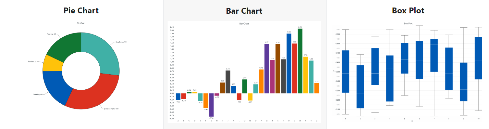

#### 2.3 Performance Characteristics
LightningChart handling millions of data points with ease and maintaining smooth user interactions. One of the standout aspects of LightningChart Python is its performance. The library is optimized for handling large volumes of data with minimal latency, which is crucial for financial applications where data needs to be processed and visualized in real-time to inform trading decisions.

### 3. Setting Up Python Environment

#### 3.1 Installing Python and Necessary Libraries
Install Python from the [official website](https://www.python.org/downloads/) and use pip to install necessary libraries including LightningChart Python from PyPI. To get the [documentation](https://lightningchart.com/python-charts/docs/) and the [license](https://lightningchart.com/python-charts/), please visit [LightningChart Website](https://lightningchart.com/).

```python
pip install lightningcharts random numpy pandas nltk
```

```python
# Importing the libraries
import lightningchart as lc
import random
lc.set_license('my-license-key')

import numpy as np 
import pandas as pd 
import yfinance as yf
from datetime import datetime
import time
import nltk
nltk.download('vader_lexicon')
from nltk.sentiment import SentimentIntensityAnalyzer
!pip install yfinance
```

#### 3.2 Overview of Libraries Used
- **LightningChart**: Advanced data visualization.
- **NumPy**: Numerical computation.
- **Pandas**: Data manipulation and analysis.
- **NLTK**: Uses for natural language processing tasks.

#### 3.3 Setting Up Your Development Environment
Recommended IDEs include Jupyter Notebook, PyCharm, or Visual Studio Code.

### 4. Loading and Processing Data

#### 4.1 How to Load the Data Files
To perform stock market sentiment analysis, you'll need historical stock price data and sentiment data from social media. For this example, we will use the stock data for Apple from yfinance and a Twitter dataset containing all tweets related to Apple company:

#### A. Load Apple Stock Data Using yfinance:
First, install the yfinance library to fetch the stock data:

```python
pip install yfinance
```

#### B. Load and Merge Twitter Data:
Use Pandas to load and merge CSV files containing tweets and company tweets related to Apple in 2018:

```python
import pandas as pd

# import tweets
tweets=pd.read_csv('./Tweet.csv')
company_tweet=pd.read_csv('./Company_Tweet.csv')

tweets=tweets.merge(company_tweet,how='left',on='tweet_id')
# format dates
tweets['date'] = pd.to_datetime(tweets['post_date'], unit='s').dt.date
tweets.date=pd.to_datetime( tweets.date,errors='coerce')
tweets['time'] = pd.to_datetime(tweets['post_date'], unit='s').dt.time
```

#### C. Fetch Historical Data for Apple:
Use yfinance to fetch the stock data for Apple and prepare it for analysis:

```python
import yfinance as yf

# Fetch historical data for Apple
aapl = yf.Ticker("AAPL")
hist = aapl.history(period="max")

# Define the stock symbol and date range
stock_symbol = "AAPL"
start_date = "2018-01-01"
end_date = "2018-12-31"
```

#### 4.2 Handling and preprocessing the data
After using Pandas to read the stock and Twitter data into DataFrames, you need to preprocess the text data using NLTK. 

```python
import nltk
nltk.download('vader_lexicon')
from nltk.sentiment import SentimentIntensityAnalyzer


sia = SentimentIntensityAnalyzer()

def get_sentiment(tweets,ticker='AAPL',start='2018-01-01',end='2018-12-31'):
#sbuset
df=tweets.loc[((tweets.ticker_symbol==ticker)&(tweets.date>=start)&(tweets.date<=end))]
# applt the SentimentIntensityAnalyzer
df.loc[:,('score')]=df.loc[:,'body'].apply(lambda x: sia.polarity_scores(x)['compound'])
# create label
#bins= pd.interval_range(start=-1, freq=3, end=1)
df.loc[:,('label')]=pd.cut(np.array(df.loc[:,'score']),bins=[-1, -0.66, 0.32, 1],right=True ,labels=["bad", "neutral", "good"])

df=df.loc[:,["date","score","label","tweet_id","body"]]
return df
```

```python
# Customizing Sentiment Analyzer with Financial Lexicon
positive_words='high profit Growth Potential Opportunity Bullish Strong Valuable Success Promising Profitable Win Winner Outstanding Record Earnings Breakthrough buy bull long support undervalued underpriced cheap upward rising trend moon rocket hold breakout call beat support buying holding'
negative_words='resistance squeeze cover seller Risk Loss Decline Bearish Weak Declining Uncertain Troubling Downturn Struggle Unstable Volatile Slump Disaster Plunge sell bear bubble bearish short overvalued overbought overpriced expensive downward falling sold sell low put miss'

dictOfpos = { i : 4 for i in positive_words.split(" ") }
dictOfneg = { i : -4 for i in negative_words.split(" ")  }
Financial_Lexicon = {**dictOfpos, **dictOfneg}

sia.lexicon.update(Financial_Lexicon)

# Getting tweets
start='2018-01-01'
end='2018-12-31'
ticker='AAPL'
tw=get_sentiment(tweets,ticker,start,end)
tw.head()
```

#### 4.3 Validation of the Study
For the validation of the study, correlation coefficients and Granger causality tests were used with the following results:

#### A. Pearson Correlation Coefficient
- Pearson correlation coefficient: -0.530767909708746
- P-value: 6.482098099400659e-28

#### B. Granger Causality Tests
- Lag 1: F=7.7905, p=0.0055
- Lag 2: F=30.3268, p=0.0000
- Lag 3: F=17.9410, p=0.0000
- Lag 4: F=25.6827, p=0.0000
- Lag 5: F=24.3062, p=0.0000

The negative Pearson correlation and the statistically significant Granger causality results collectively suggest that sentiment analysis using Twitter data can be a valuable tool for predicting stock market trends. Specifically, the moderate negative correlation and significant causality tests imply that changes in public sentiment precede and predict movements in stock prices, highlighting the potential of integrating sentiment analysis into trading strategies.

### 5. Visualizing Data with LightningChart

#### 5.1 Introduction to LightningChart for Python
LightningChart Python allows for the creation of highly interactive and customizable charts. Here are some of the LC charts below:

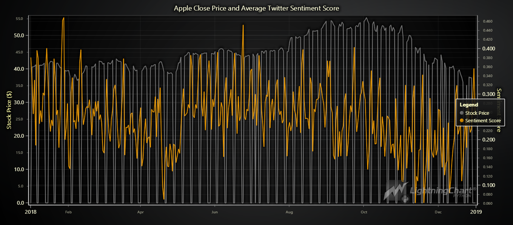
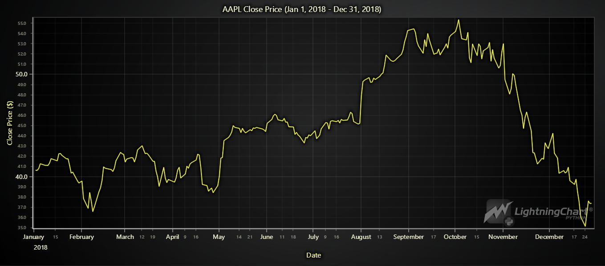
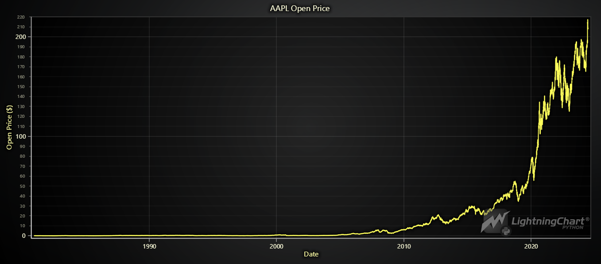
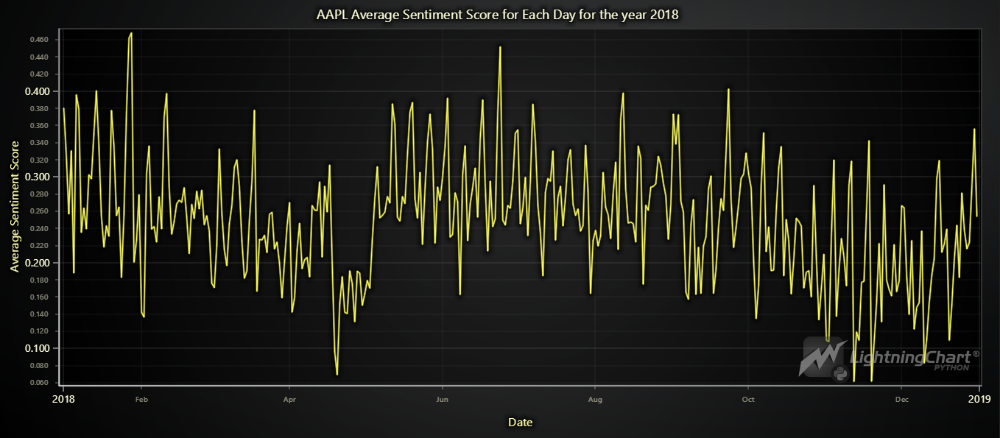
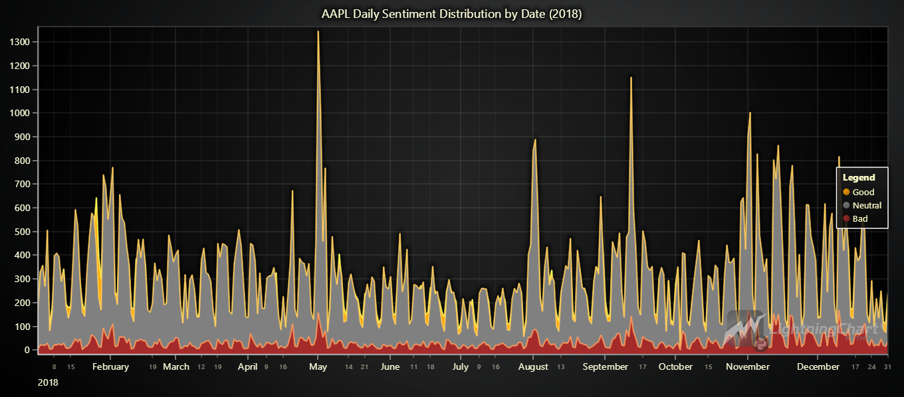
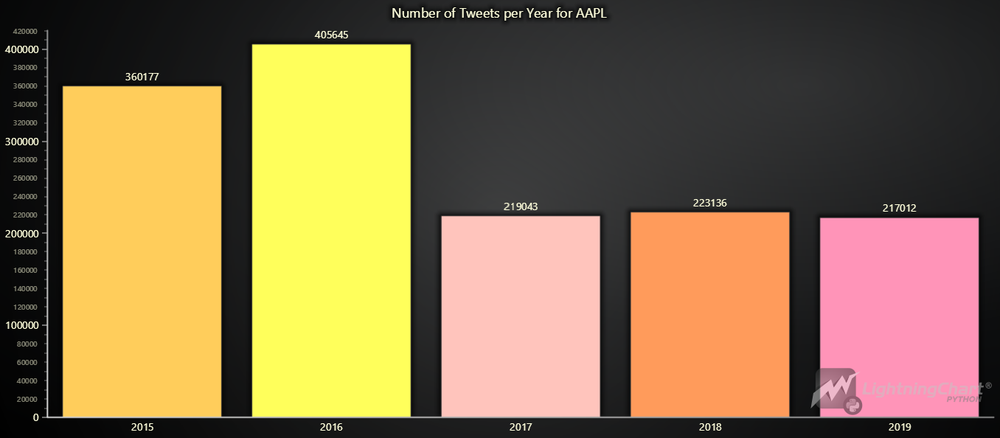
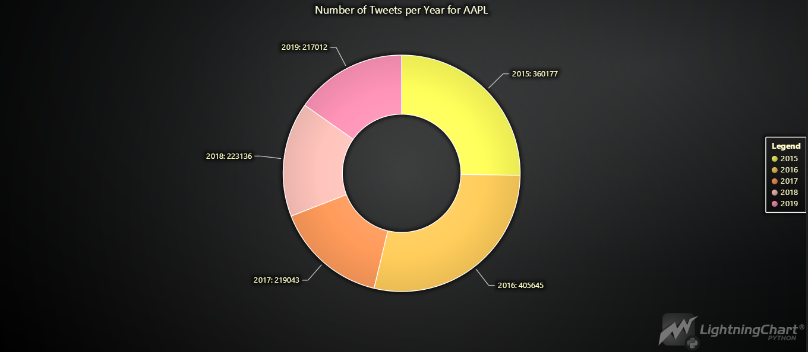
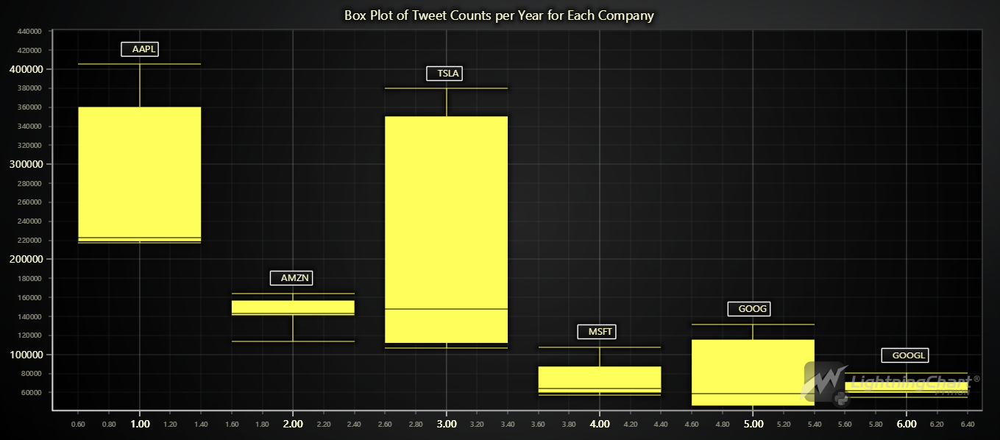
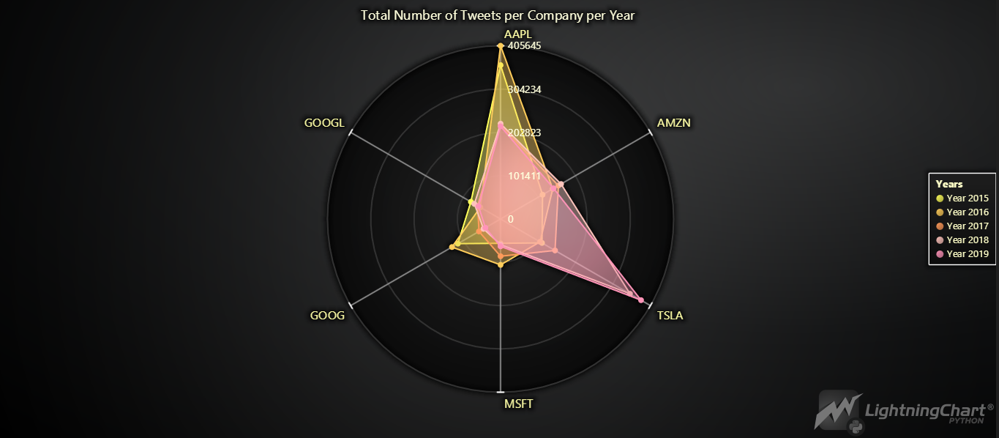
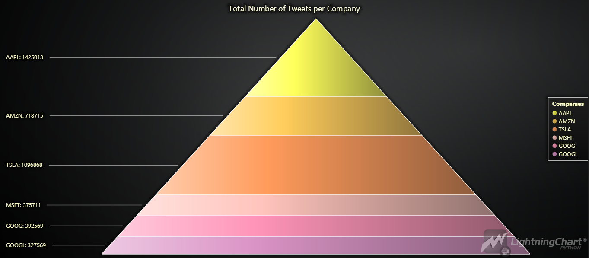
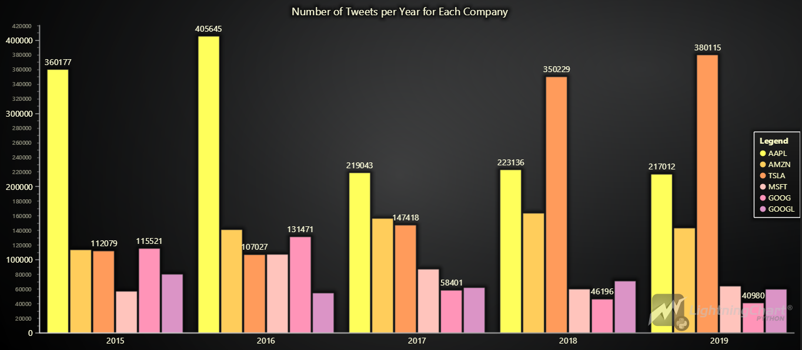

#### 5.2 Creating the charts
To visualize the data, you can create various charts using LightningChart Python:

```python
import lightningchart as lc
import random

# Initialize LightningChart and set the license key
lc.set_license('my-license-key')

# Create a BarChart using LightningChart
chart = lc.BarChart(title= 'Number of Tweets per Year for AAPL')
```

#### 5.3 Customizing visualizations
LightningChart offers extensive customization options. You can change the theme and colors, add markers, hide or sort some features or integrate real-time data updates to enhance the visualization:

```python
chart = lc.BarChart(
vertical=True,
theme=lc.Themes.Dark,
title='Number of Tweets per Year for AAPL'
)

# Define colors for each bar
colors = ["#FF5733", "#33FF57", "#3357FF", "#F5A623", "#D0021B"]

# Prepare data with color information
data = []
for year, value, color in zip(years, tweet_counts_values, colors):
    data.append({
        'category': year,
        'value': value,
        'color': color
    })

# Set data with color information
chart.set_data(data)

# Open the chart
chart.set_sorting('alphabetical')
chart.open()
```

### 6. Conclusion

#### 6.1 Recap of creating the application
In this project, we covered the essentials of performing stock market sentiment analysis using Python and visualizing the results with LightningChart. We discussed setting up the Python environment, loading and preprocessing data, and creating insightful visualizations with LightningChart.

#### 6.2 Why is it useful?
Stock market sentiment analysis using Python provides traders and analysts with a deeper understanding of market trends driven by public sentiment. This approach complements traditional analysis methods, offering a more comprehensive market view.

#### 6.3 Benefits of using LightningChart Python for visualizing data
LightningChart Python stands out for its high performance and flexibility, making it an ideal choice for visualizing large and complex datasets in real-time. Its wide range of features and customization options enables users to create informative and visually appealing charts, enhancing the overall analysis process.
By leveraging the power of sentiment analysis and advanced visualization tools like LightningChart, traders can gain valuable insights and make more informed decisions in the dynamic world of stock trading.


